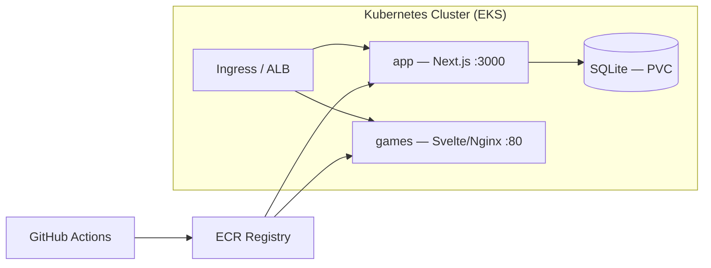

# RustyCogs.io — Deployment Guide

> **Audience**: Client DevOps team  
> **Stack**: AWS · Kubernetes (EKS) · GitHub Actions · Docker

---

## Architecture Overview



| Service   | Stack                           | Port | Dockerfile         | Image Size |
| --------- | ------------------------------- | ---- | ------------------ | ---------- |
| **app**   | Next.js 16, SQLite, Drizzle ORM | 3000 | `app/Dockerfile`   | ~180 MB    |
| **games** | SvelteKit + Nginx               | 80   | `games/Dockerfile` | ~30 MB     |

**Database**: SQLite file at `/app/data/brain.db` — mounted via PersistentVolumeClaim (EBS).

---

## 1. AWS Infrastructure

### Prerequisites

| Resource           | Service             | Notes                                             |
| ------------------ | ------------------- | ------------------------------------------------- |
| Container registry | **ECR**             | Two repos: `brain-games/app`, `brain-games/games` |
| K8s cluster        | **EKS**             | 1.28+, 2+ nodes `t3.medium`                       |
| Persistent storage | **EBS CSI**         | For SQLite `PersistentVolume`                     |
| DNS                | **Route 53**        | A-record → ALB                                    |
| TLS                | **ACM**             | Certificate for your domain                       |
| Secrets            | **Secrets Manager** | `AUTH_SECRET`, `GOOGLE_AI_API_KEY`                |

### Create ECR Repositories

```bash
aws ecr create-repository --repository-name brain-games/app --region eu-central-1
aws ecr create-repository --repository-name brain-games/games --region eu-central-1
```

### EKS Cluster Setup

```bash
eksctl create cluster \
  --name brain-games \
  --region eu-central-1 \
  --nodegroup-name workers \
  --node-type t3.medium \
  --nodes 2 \
  --managed

# Install EBS CSI driver (required for PVC)
eksctl create addon --name aws-ebs-csi-driver --cluster brain-games
```

---

## 2. GitHub Actions CI/CD

Create `.github/workflows/deploy.yml`:

```yaml
name: Build & Deploy

on:
  push:
    branches: [main]

env:
  AWS_REGION: eu-central-1
  ECR_REGISTRY: ${{ secrets.AWS_ACCOUNT_ID }}.dkr.ecr.eu-central-1.amazonaws.com
  EKS_CLUSTER: brain-games

jobs:
  build-and-deploy:
    runs-on: ubuntu-latest
    permissions:
      id-token: write
      contents: read

    steps:
      - uses: actions/checkout@v4

      - name: Configure AWS Credentials
        uses: aws-actions/configure-aws-credentials@v4
        with:
          role-to-arn: ${{ secrets.AWS_ROLE_ARN }}
          aws-region: ${{ env.AWS_REGION }}

      - name: Login to ECR
        uses: aws-actions/amazon-ecr-login@v2

      - name: Build & Push — app
        run: |
          docker build ./app \
            --build-arg NEXT_PUBLIC_FRONTEND_URL=${{ vars.FRONTEND_URL }} \
            --build-arg NEXT_PUBLIC_MODE=${{ vars.PLATFORM_MODE || 'saas' }} \
            --build-arg NEXT_PUBLIC_PLATFORM_NAME="${{ vars.PLATFORM_NAME }}" \
            --build-arg NEXT_PUBLIC_PLATFORM_ACCENT="${{ vars.PLATFORM_ACCENT }}" \
            --build-arg NEXT_PUBLIC_PLATFORM_LOGO="${{ vars.PLATFORM_LOGO }}" \
            --build-arg NEXT_PUBLIC_HIDE_LANDING="${{ vars.HIDE_LANDING || 'false' }}" \
            --build-arg NEXT_PUBLIC_HIDE_REGISTER="${{ vars.HIDE_REGISTER || 'false' }}" \
            -t $ECR_REGISTRY/brain-games/app:${{ github.sha }} \
            -t $ECR_REGISTRY/brain-games/app:latest
          docker push $ECR_REGISTRY/brain-games/app --all-tags

      - name: Build & Push — games
        run: |
          docker build ./games \
            --build-arg VITE_API_URL=${{ vars.API_URL }} \
            -t $ECR_REGISTRY/brain-games/games:${{ github.sha }} \
            -t $ECR_REGISTRY/brain-games/games:latest
          docker push $ECR_REGISTRY/brain-games/games --all-tags

      - name: Deploy to EKS
        run: |
          aws eks update-kubeconfig --name $EKS_CLUSTER --region $AWS_REGION
          kubectl set image deployment/app \
            app=$ECR_REGISTRY/brain-games/app:${{ github.sha }} \
            -n brain-games
          kubectl set image deployment/games \
            games=$ECR_REGISTRY/brain-games/games:${{ github.sha }} \
            -n brain-games
          kubectl rollout status deployment/app -n brain-games --timeout=120s
          kubectl rollout status deployment/games -n brain-games --timeout=120s
```

### Required GitHub Secrets & Variables

| Type     | Name              | Value                           |
| -------- | ----------------- | ------------------------------- |
| Secret   | `AWS_ACCOUNT_ID`  | Your 12-digit AWS account ID    |
| Secret   | `AWS_ROLE_ARN`    | IAM role ARN for OIDC           |
| Variable | `API_URL`         | `https://api.yourdomain.com`    |
| Variable | `FRONTEND_URL`    | `https://games.yourdomain.com`  |
| Variable | `PLATFORM_MODE`   | `saas` or `whitelabel`          |
| Variable | `PLATFORM_NAME`   | Custom platform name (optional) |
| Variable | `PLATFORM_ACCENT` | Hex color (optional)            |
| Variable | `PLATFORM_LOGO`   | Logo URL (optional)             |
| Variable | `HIDE_LANDING`    | `true` / `false` (optional)     |
| Variable | `HIDE_REGISTER`   | `true` / `false` (optional)     |

---

## 3. Kubernetes Manifests

Create all files in a `k8s/` directory at the repo root.

### Namespace — `k8s/namespace.yml`

```yaml
apiVersion: v1
kind: Namespace
metadata:
  name: brain-games
```

### Secrets — `k8s/secrets.yml`

> [!CAUTION]
> Do NOT commit this file to Git. Use `kubectl apply -f` directly, or use AWS Secrets Manager with External Secrets Operator.

```yaml
apiVersion: v1
kind: Secret
metadata:
  name: app-secrets
  namespace: brain-games
type: Opaque
stringData:
  AUTH_SECRET: "<generate with: openssl rand -base64 32>"
  GOOGLE_AI_API_KEY: "<your Gemini API key>"
```

### PVC for SQLite — `k8s/pvc.yml`

```yaml
apiVersion: v1
kind: PersistentVolumeClaim
metadata:
  name: app-data
  namespace: brain-games
spec:
  accessModes: [ReadWriteOnce]
  storageClassName: gp3
  resources:
    requests:
      storage: 1Gi
```

### App Deployment — `k8s/app-deployment.yml`

```yaml
apiVersion: apps/v1
kind: Deployment
metadata:
  name: app
  namespace: brain-games
spec:
  replicas: 1 # Must be 1 — SQLite doesn't support concurrent writers
  strategy:
    type: Recreate # Ensures volume is released before new pod starts
  selector:
    matchLabels:
      app: brain-games-app
  template:
    metadata:
      labels:
        app: brain-games-app
    spec:
      containers:
        - name: app
          image: <ECR_REGISTRY>/brain-games/app:latest
          ports:
            - containerPort: 3000
          env:
            - name: DATABASE_PATH
              value: /app/data/brain.db
            - name: AUTH_URL
              value: https://api.yourdomain.com
            - name: AUTH_SECRET
              valueFrom:
                secretKeyRef:
                  name: app-secrets
                  key: AUTH_SECRET
            - name: GOOGLE_AI_API_KEY
              valueFrom:
                secretKeyRef:
                  name: app-secrets
                  key: GOOGLE_AI_API_KEY
          volumeMounts:
            - name: data
              mountPath: /app/data
          resources:
            requests:
              cpu: 100m
              memory: 256Mi
            limits:
              cpu: 500m
              memory: 512Mi
          readinessProbe:
            httpGet:
              path: /api/auth/session
              port: 3000
            initialDelaySeconds: 5
            periodSeconds: 10
          livenessProbe:
            httpGet:
              path: /api/auth/session
              port: 3000
            initialDelaySeconds: 10
            periodSeconds: 30
      volumes:
        - name: data
          persistentVolumeClaim:
            claimName: app-data
```

### Games Deployment — `k8s/games-deployment.yml`

```yaml
apiVersion: apps/v1
kind: Deployment
metadata:
  name: games
  namespace: brain-games
spec:
  replicas: 2 # Stateless — scale freely
  selector:
    matchLabels:
      app: brain-games-games
  template:
    metadata:
      labels:
        app: brain-games-games
    spec:
      containers:
        - name: games
          image: <ECR_REGISTRY>/brain-games/games:latest
          ports:
            - containerPort: 80
          resources:
            requests:
              cpu: 50m
              memory: 64Mi
            limits:
              cpu: 200m
              memory: 128Mi
          readinessProbe:
            httpGet:
              path: /
              port: 80
            initialDelaySeconds: 3
            periodSeconds: 10
```

### Services — `k8s/services.yml`

```yaml
apiVersion: v1
kind: Service
metadata:
  name: app
  namespace: brain-games
spec:
  selector:
    app: brain-games-app
  ports:
    - port: 3000
      targetPort: 3000
---
apiVersion: v1
kind: Service
metadata:
  name: games
  namespace: brain-games
spec:
  selector:
    app: brain-games-games
  ports:
    - port: 80
      targetPort: 80
```

### Ingress (ALB) — `k8s/ingress.yml`

> [!IMPORTANT]
> Requires the [AWS Load Balancer Controller](https://docs.aws.amazon.com/eks/latest/userguide/aws-load-balancer-controller.html) installed on the cluster.

```yaml
apiVersion: networking.k8s.io/v1
kind: Ingress
metadata:
  name: brain-games
  namespace: brain-games
  annotations:
    kubernetes.io/ingress.class: alb
    alb.ingress.kubernetes.io/scheme: internet-facing
    alb.ingress.kubernetes.io/target-type: ip
    alb.ingress.kubernetes.io/certificate-arn: <ACM_CERTIFICATE_ARN>
    alb.ingress.kubernetes.io/listen-ports: '[{"HTTPS":443}]'
    alb.ingress.kubernetes.io/ssl-redirect: "443"
spec:
  rules:
    - host: api.yourdomain.com
      http:
        paths:
          - path: /
            pathType: Prefix
            backend:
              service:
                name: app
                port:
                  number: 3000
    - host: games.yourdomain.com
      http:
        paths:
          - path: /
            pathType: Prefix
            backend:
              service:
                name: games
                port:
                  number: 80
```

---

## 4. Initial Deployment

```bash
# 1. Create namespace
kubectl apply -f k8s/namespace.yml

# 2. Create secrets (do NOT commit this command to Git)
kubectl apply -f k8s/secrets.yml

# 3. Create storage
kubectl apply -f k8s/pvc.yml

# 4. Deploy services
kubectl apply -f k8s/app-deployment.yml
kubectl apply -f k8s/games-deployment.yml
kubectl apply -f k8s/services.yml
kubectl apply -f k8s/ingress.yml

# 5. Seed the database (first deploy only)
kubectl exec -it deployment/app -n brain-games -- \
  node -e "require('./src/db/index.js')"

# 6. Verify
kubectl get pods -n brain-games
kubectl get ingress -n brain-games
```

---

## 5. Environment Variables Reference

| Variable                   | Required | Default              | Description                                               |
| -------------------------- | -------- | -------------------- | --------------------------------------------------------- |
| `AUTH_SECRET`              | ✅       | —                    | Session encryption key                                    |
| `AUTH_URL`                 | ✅       | —                    | Public URL of the app (e.g. `https://api.yourdomain.com`) |
| `DATABASE_PATH`            | ✅       | `/app/data/brain.db` | SQLite file path inside container                         |
| `GOOGLE_AI_API_KEY`        | ❌       | —                    | Gemini API key for AI word generation                     |
| `NEXT_PUBLIC_FRONTEND_URL` | ✅       | —                    | Public URL of the games frontend (build-time)             |
| `NEXT_PUBLIC_MODE`         | ❌       | `saas`               | `saas` or `whitelabel` (build-time)                       |
| `VITE_API_URL`             | ✅       | —                    | API URL for the games frontend (build-time)               |

---

## 6. Operational Notes

### Backups

```bash
# Backup SQLite database
kubectl cp brain-games/$(kubectl get pod -n brain-games -l app=brain-games-app -o jsonpath='{.items[0].metadata.name}'):/app/data/brain.db ./backup-$(date +%Y%m%d).db
```

### Scaling

| Service   | Can Scale?        | Notes                                                                      |
| --------- | ----------------- | -------------------------------------------------------------------------- |
| **app**   | ❌ Single replica | SQLite = single writer. Migrate to PostgreSQL (RDS) for horizontal scaling |
| **games** | ✅ Freely         | Stateless static files                                                     |

### Logs

```bash
kubectl logs -f deployment/app -n brain-games
kubectl logs -f deployment/games -n brain-games
```

> [!WARNING]
> **SQLite limitation**: The `app` deployment must remain at **1 replica** because SQLite doesn't support concurrent writers. If you need horizontal scaling, migrate to PostgreSQL (AWS RDS) and update the Drizzle ORM configuration.
